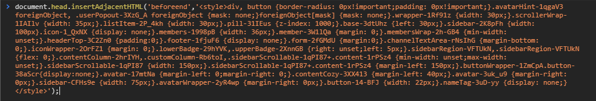
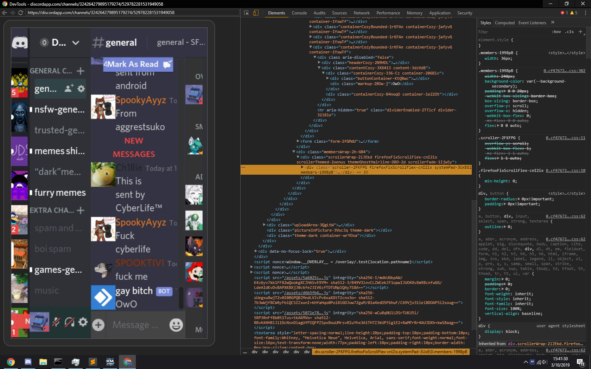
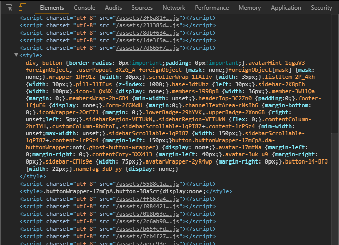

[dmackserv]: https://discord.gg/4GJvzEp
# DiscordMobileWeb
## [Support Server][dmackserv] 
## A bit of CSS that attempts to make the Discord Web Client usable on Android devices using Chromium/Chrome. (Desktop debugger needed!)

# How do I use this? 
(I assume you've already attached DevTools to your Android device!) 

1. Download runMeInConsole.js 
2. Copy the text inside the file to clipboard 
3. Paste in console and hit enter! 

4. Profit..? Maybe? 

